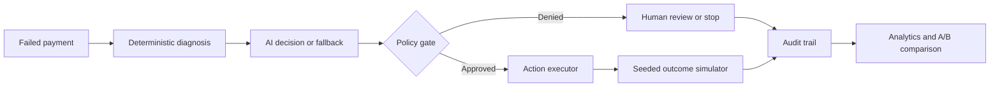

# RecoverAI

> AI-powered bounded revenue recovery agent for failed payments, with deterministic financial guardrails around every AI recommendation.

RecoverAI is a production-style reference product for Razorpay's AI Revenue Recovery buildathon. It diagnoses why a payment failed, estimates whether revenue is recoverable, selects the intervention most likely to work, asks an explicit policy engine for authorization, and records the decision and simulated outcome in an audit trail.

> **Simulation disclosure:** recovered amounts shown by RecoverAI are deterministic simulation outcomes, not recovered live customer money. The simulator exists so strategies can be compared reproducibly without manipulating real payments.

## The problem

Retry-all systems treat an issuer outage, insufficient funds, an expired card, and suspected fraud as if they were the same. This wastes attempts, contacts customers at the wrong time, and can automate unsafe behavior.

RecoverAI separates intelligence from authority:



## Demo in under three minutes

1. Copy `.env.example` to `.env`.
2. Run `npm install`.
3. Run `npm run dev`.
4. Open `http://localhost:3000`.
5. Open **Command center**, select **Reset demo**, then run **Naive baseline** and **RecoverAI**.
6. Open `golden-success-2026` for an approved ₹4,999 recovery, then `golden-guardrail-2026` for an AI retry blocked by the retry-limit policy.

The API starts with a reproducible 100-case batch, so OpenAI and Razorpay credentials are optional.

## Architecture and stack

- `apps/web`: Next.js 15, React 19, TypeScript, Tailwind, Recharts
- `apps/api`: Express 5 REST service, Zod validation, Helmet, CORS, rate limits, structured logs
- `packages/domain`: framework-independent diagnosis, policy, simulation, and experiment logic
- `prisma`: PostgreSQL schema and deterministic seed path
- `tests`: unit and integration coverage for safety boundaries and webhook behavior
- `docs`: architecture, agent-safety design, and demo script

Routes include `/api/cases`, `/api/batches/:id/run-recoverai`, `/api/batches/:id/run-baseline`, `/api/analytics/summary`, `/api/escalations`, and the signed `/api/webhooks/razorpay` ingestion endpoint.

## Environment

| Variable | Required | Purpose |
|---|---:|---|
| `DATABASE_URL` | Production | PostgreSQL connection used by Prisma |
| `OPENAI_API_KEY` | No | Enables structured AI decisions; safe fallback is automatic |
| `OPENAI_MODEL` | No | Defaults to `gpt-5-mini` |
| `RAZORPAY_WEBHOOK_SECRET` | Razorpay events | HMAC-SHA256 webhook verification |
| `RAZORPAY_KEY_ID` / `RAZORPAY_KEY_SECRET` | Future test actions | Razorpay Test Mode credentials |
| `EXECUTION_MODE` | No | Defaults to `SIMULATION` |
| `NEXT_PUBLIC_API_URL` | No | Browser-visible API base URL |

Never expose secret variables through `NEXT_PUBLIC_*`. No PAN, CVV, or other card credentials are stored.

## PostgreSQL setup

```bash
docker compose up -d postgres
npm run db:generate
npm run db:migrate
npm run db:seed
```

The demo defaults to the in-memory repository so judges can run it instantly. Set `PERSISTENCE_MODE=POSTGRES` to select the Prisma repository. A production deployment should additionally move batch work to a durable job queue.

## Razorpay Test Mode

Create a webhook in the Razorpay test dashboard targeting `POST /api/webhooks/razorpay`, subscribe to `payment.failed`, and set the same secret in `RAZORPAY_WEBHOOK_SECRET`. The API verifies the exact raw body with HMAC-SHA256, rejects invalid signatures, and de-duplicates `x-razorpay-event-id`. Unsupported recovery operations remain explicitly simulated.

## Evaluation Methodology

### Population

Seed `2026` creates 100 synthetic failed-payment cases covering transient bank/network faults, UPI failures, authentication, insufficient funds, instrument issues, abandonment, permanent failures, unknown codes, and fraud-like signals. Amount, method, initial retry/contact history, risk, and synthetic loyalty are deterministic. Every strategy run restores these initial fields, so earlier UI actions cannot contaminate an experiment.

### Outcome model

Each case receives one stable latent outcome draw derived from its seed and ID. Both strategies use that same draw—there is no strategy-specific luck. The success threshold changes with failure category, intervention, retry count, payment method, delay, and synthetic history. For example, a delayed retry has a higher modeled probability for an issuer outage, while a reminder is more appropriate for insufficient funds. `Math.random()` is never used.

These probabilities are transparent evaluation assumptions, not production-calibrated recovery rates. A production model would be calibrated and back-tested against consented merchant outcomes.

### Strategies

- **Naive baseline:** one immediate retry for every retry-eligible case, excluding terminal, permanent-failure, and fraud-risk cases. It does not choose context-specific interventions.
- **RecoverAI:** deterministic diagnosis, a schema-valid reproducible decision model for the benchmark, deterministic policy authorization, then the selected intervention. Live case planning can call OpenAI when configured, but benchmark runs deliberately force the fallback decision model so the same seed always produces the same result.
- **Guardrails:** both the materialized demo and pure evaluator enforce retry caps, fraud controls, permanent-failure stops, confidence escalation, contact caps, cooldowns, and expected-value thresholds.

### Metrics

Revenue at risk is the sum of original failed-payment values. Recovered revenue is counted only when the simulator marks an intervention successful. Recovery rate by value is recovered value divided by value at risk. Attempts, contacts, escalations, unsafe actions prevented, action-level success, and incremental value versus baseline are derived from run data—not hardcoded UI values.

The comparison demonstrates relative strategy behavior under stated assumptions; it does not guarantee production recovery rates or claim live Razorpay revenue was recovered.

### Verified seed-2026 reference run

| Metric | Result |
|---|---:|
| Revenue at risk | ₹6,75,300 |
| Naive baseline simulated recovery | ₹1,51,473 |
| RecoverAI simulated recovery | ₹3,16,750 |
| Incremental simulated revenue | +₹1,65,277 |
| Baseline / RecoverAI attempts | 81 / 72 |
| Unsafe actions prevented | 9 |
| Human escalations | 19 |

These values are generated by the checked-in seed and methodology. Tests assert reproducibility; the dashboard still calculates them from the run rather than embedding them as UI constants.

## Safety and reliability

- AI output is Zod-validated and can only choose a closed action enum.
- AI is advisory; policies control retries, risk, confidence, expected value, cooldowns, contact caps, stopping, and duplicates.
- Missing, invalid, or timed-out AI responses fall back to deterministic decisions.
- Webhooks use exact raw-body HMAC verification and transactionally claim event IDs before case persistence.
- Execution atomically claims idempotency keys before performing a simulated action and rechecks policy immediately before execution.
- Error responses avoid leaking secrets or raw provider internals.

## Quality checks

```bash
npm test
npm run typecheck
npm run lint
npm run build
```

## Screenshots

No screenshot files are committed yet. Before the GitHub submission, capture these three demo states and save them with stable filenames:

- `/docs/images/dashboard.png.png`: dashboard with strategy comparison after seed-2026 baseline and RecoverAI runs
- `docs/images/golden-success.png.png`: `golden-success-2026` showing approved simulated recovery
- `docs/images/golden-guardrail.png.png`: `golden-guardrail-2026` showing policy override and no unsafe execution

## Limitations and production evolution

This build does not claim that a generic payment can be retried through a public Razorpay API. Production recovery would use merchant-specific payment-link/subscription capabilities, consent rules, durable queues, encrypted PII, RBAC, tenancy, observability, model/version tracking, calibrated probabilities from real outcomes, and compliance review. See [architecture](docs/architecture.md) and [agent design](docs/agent-design.md).

## License

No repository license has been selected yet. Choose and add a LICENSE file before publishing if you want explicit reuse terms.
