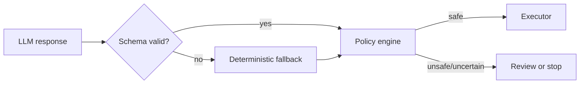

# Agent design and safety boundaries

## Why AI is useful

Known provider codes map cleanly to deterministic diagnoses. AI becomes useful after diagnosis, where several legitimate interventions may exist and context such as amount, prior attempts, timing, method, history, and risk changes the best choice. Its role is prioritization and contextual recommendation—not authorization.

## Where AI is not used

AI does not verify webhooks, calculate money, enforce retry/contact limits, detect duplicate execution, mutate payment status directly, choose arbitrary tools, or decide whether fraud-like cases may run. Known error-code diagnosis is deterministic. Analytics and seeded outcomes are ordinary code.

## Hallucination containment

The adapter sends a minimal payment context and requests one JSON object. Zod validates every field, numeric bound, string length, nullable delay, and closed action enum. Invalid, absent, or late output is discarded. The deterministic fallback generates a valid decision, so model availability never blocks operations.

For evaluation runs, RecoverAI intentionally forces this deterministic fallback. That prevents model-version or network variance from changing the seed-2026 benchmark. Interactive case planning may use OpenAI when configured, but policy authorization remains identical.

## Confidence and escalation

Diagnosis confidence below trusted mapping levels and AI confidence below `0.62` escalate. Unknown failures always prefer review. Risk at or above `0.75` forces review even when AI recommends retry. Policy records the rule, reason, original proposal, and final action.

## Stopping rules

Recovery stops when the payment is already recovered, an operator stops it, the failure is permanent, the retry cap is reached, expected recovery probability falls below the configured threshold, the contact cap is reached, or risk exceeds the automatic-action boundary. Customer messaging also has a 24-hour cooldown.

## Safe production evolution

Before real execution, add tenant-scoped RBAC, approval workflows for material amounts, customer consent/preferences, a durable scheduler, provider-specific action capabilities, policy configuration with review/versioning, encrypted PII, prompt/model version audit, offline probability calibration, drift detection, shadow deployments, and reconciliation against provider events. Raise autonomy only for action-category pairs with measured safety and recovery performance.
