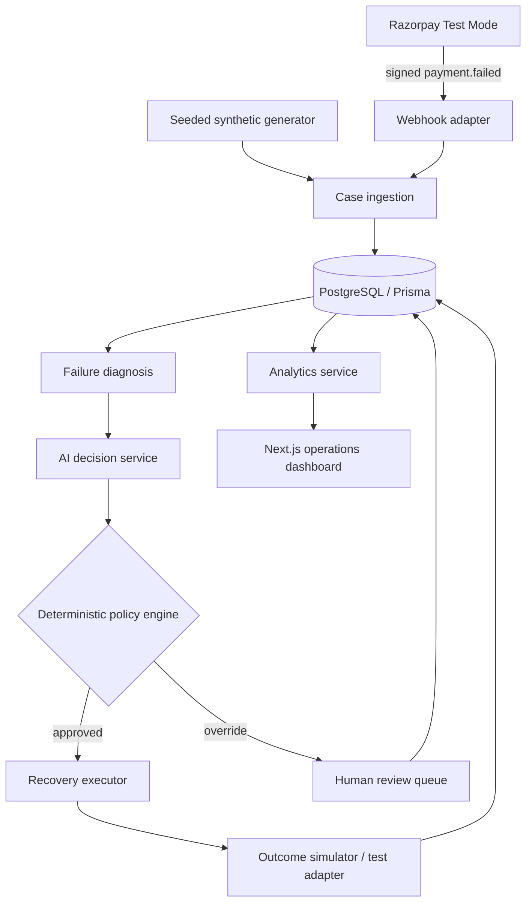
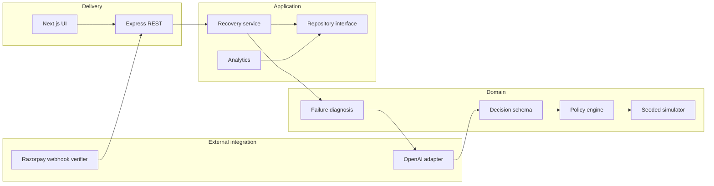
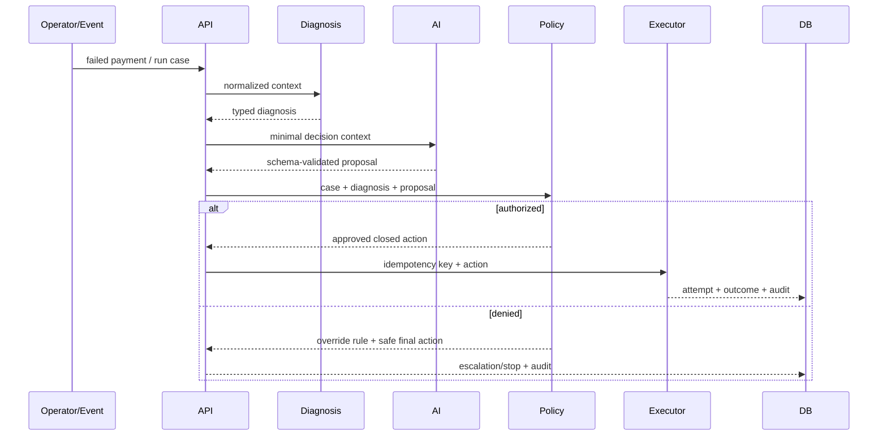

# RecoverAI architecture

## System context

The AI layer proposes. The policy layer authorizes. The executor performs only closed, typed actions. The audit stream records every transition.

## Component boundaries

Razorpay types do not enter core policy code. OpenAI can be removed without breaking the workflow. Repository implementations can be swapped between the instant in-memory demo and PostgreSQL.

## Core sequence

## Data and transactions

`PaymentCase` owns current state while `RecoveryAttempt` and `AuditEvent` retain history. Webhook event creation and case creation share a transaction. `ExecutionClaim.idempotencyKey` is atomically inserted before execution, preventing two workers from performing the same action. Attempt and audit writes are transactional in PostgreSQL. A production executor should additionally use a durable queue, leases for abandoned in-progress work, and provider-side idempotency keys.

## Deployment notes

Run the web and API as separate services. PostgreSQL is private to the API. Terminate TLS at the edge, place the webhook route behind a body-size limit, retain the raw request for HMAC verification, and use a durable queue for scheduled retries. Keep `SIMULATION` as a distinct execution mode in data and UI.
